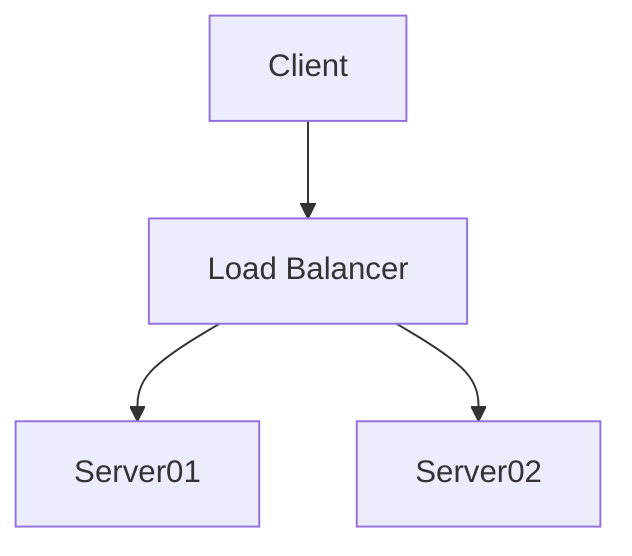

# 约定

1. 凡是浏览器端不能 import 的资源通过异步加载的方式在封装成组件使用
1. 不同于 SFC ，js 可以在一个文件中定义一个或多个组件

## 路由和导航

1. 嵌套路由只用于配置布局
1. 页面顶部导航为一级导航，每个一级导航对应一个页面
1. 侧边栏导航为二级导航，二级导航由菜单项或子菜单组成
1. 站内导航可以根据菜单生成，二级菜单的子菜单生成的菜单为禁用状态
1. 菜单包含默认标题和图标，标题可以在 onMounted 时更改
1. 菜单的图标使用动态加载 svg 的方式便于运行时更改

## 登录和注销

1. 使用 token 作为凭据，token 保存在变量中，不进行持久化
1. token 通过登陆或刷新时从服务的获取
1. 初始化刷新 token 成功或登录成功后，启用定时器定时刷新 token
1. refresh token 存储在服务的返回的特定路径的 cookie 中
1. 刷新时 refresh token 同时被刷新
1. refresh token 过期前每次刷新都会重置 refresh token 的过期时间
1. 注销时请求服务器删除 包含 refresh token 的 cookie，成功后设置 token 为 null 并根据当前路由的权限属性判断是否需要跳转到登录页
1. 注销时通过 localStorage 事件通知其他 tab 页，其他 tab 页设置 token 为 null 并根据当前路由的权限属性判断是否需要跳转到登录页

## 自定义组件

1. Svg 图标组件通过在 onMounted 方法中异步加载 .svg 图标方式实现
1. Markdown 组件通过onMounted 方法中异步加载 .md 文件方式获取内容，使用 marked 解析 markdown 内容，使用 highlight 高亮代码，使用 mermaid 实现图表
1. Chart 组件使用 echarts 和 vue-echarts 实现

```javascript
function (){
  let a=1;
  alert(a);
}
```

```json
{
  "a": 1,
  "b": "1"
}
```




```flowchart
st=>start: Start|past:>http://www.google.com[blank]
e=>end: End|future:>http://www.google.com
op1=>operation: My Operation|past
op2=>operation: Stuff|current
sub1=>subroutine: My Subroutine|invalid
cond=>condition: Yes
or No?|approved:>http://www.google.com
c2=>condition: Good idea|rejected
io=>inputoutput: catch something...|future

st->op1(right)->cond
cond(yes, right)->c2
cond(no)->sub1(left)->op1
c2(yes)->io->e
c2(no)->op2->e
```
